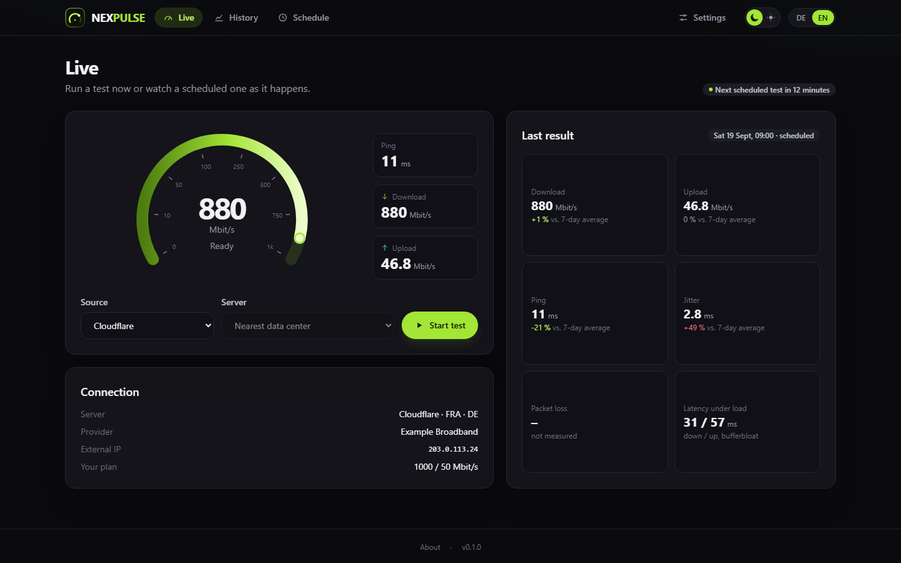
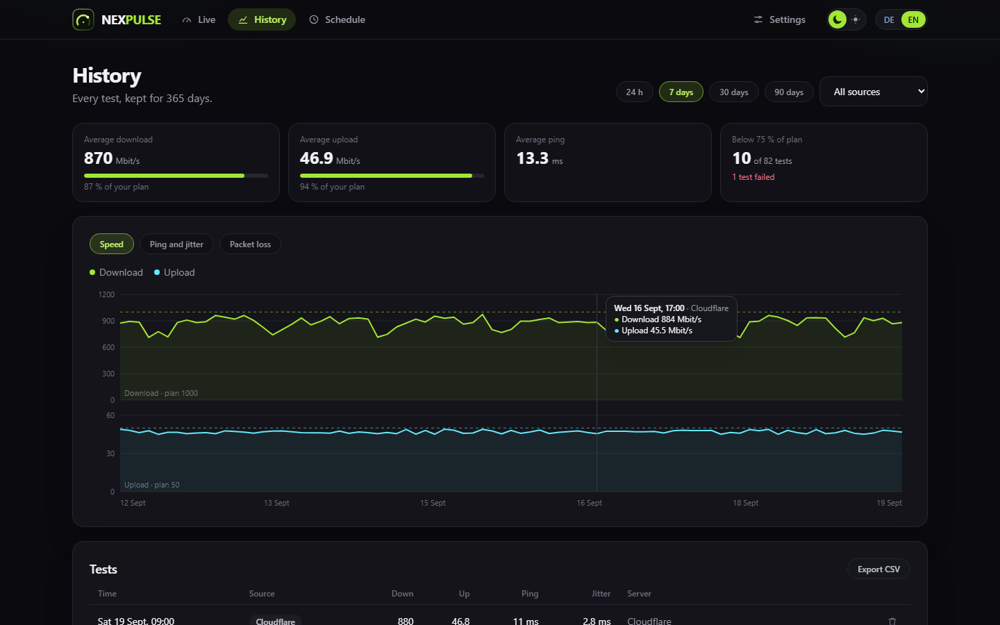
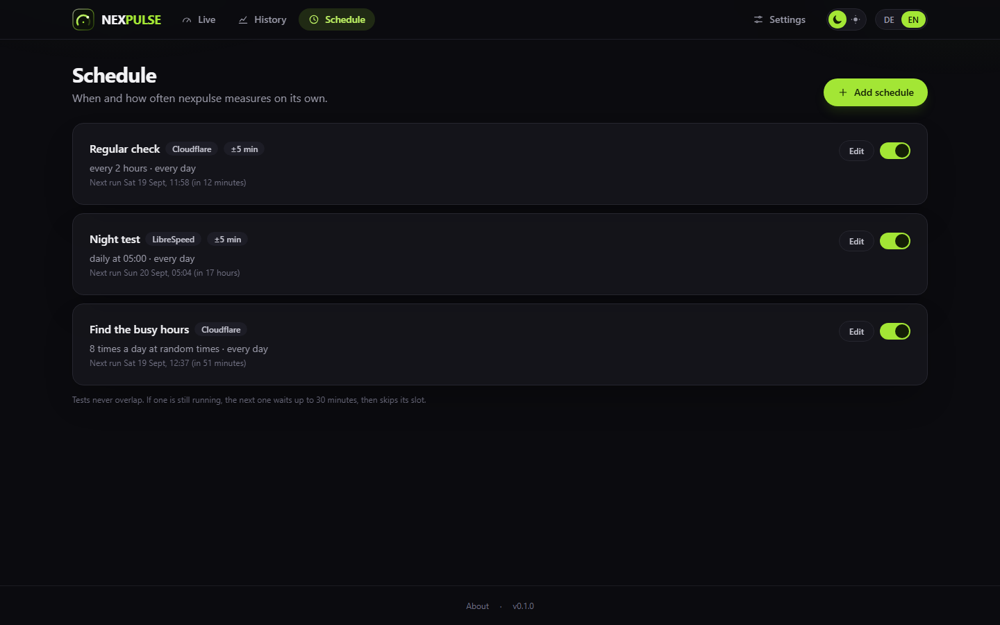

# nexpulse

A speed test tracker for your homelab. Measures on a schedule, shows every test
live on a gauge, keeps the history and tells you when your line is slower than
what you pay for.

> **Status:** early. A small side project, part of the nex apps
> ([Nexview](https://github.com/DerKezorm/nexview) and friends).



The screenshots show a throwaway instance with made-up data.

## What it does

- **Live view** with a gauge: ping, download and upload as they happen, whether
  you started the test or a schedule did.
- **Three sources:** Cloudflare (works right away), LibreSpeed (public servers or
  your own) and, if you activate it yourself, Ookla. See below.
- **Everything measurable:** download, upload, ping, jitter, lowest and highest
  ping, latency under load (bufferbloat), and packet loss where the source
  measures it.
- **Schedules:** every n minutes, once a day, a cron expression, or **n times a
  day at random times**: the day is split into n equal parts with one test at a
  random minute in each, drawn anew every day, so over a few weeks every hour is
  covered and busy times show up. All of them can be limited to weekdays and a
  time window. Tests never overlap.
- **History** with charts, averages and a CSV export.
- **Your plan:** enter what your provider promises, and nexpulse marks tests
  below a threshold of it.
- **Alerts** via ntfy, Gotify or a webhook: slow test, high ping, failed test.
- **API** for dashboards like [nexdeck](https://github.com/DerKezorm/nexdeck) or
  Home Assistant, with keys that can only read or also start tests.
- **No accounts.** Optionally one password for the interface. The API always
  needs a key.
- German and English, dark and light.



## Sources

| Source | Server choice | Packet loss | Notes |
|---|---|---|---|
| Cloudflare | automatic (nearest data center) | no | The same endpoints as speed.cloudflare.com. Cloudflare refuses tests that come too often; one an hour is plenty. |
| LibreSpeed | automatic, a public server or your own | no | Automatic pings all servers, tries the nearest ones briefly and takes the fastest. |
| Ookla | automatic or any nearby server | yes | Not included. See below. |

### About Ookla

nexpulse does not ship any Ookla software. If you activate Ookla in the
settings, nexpulse downloads the official Speedtest CLI from Ookla into your
data folder.

**Ookla's license does not cover this use.** It allows the CLI only for
personal, non-commercial use on a single personal computer, and forbids running
it on a device that other devices can reach over the network, or on routers,
modems or other devices that are not personal computers. A container in a
homelab falls under that. nexpulse says so before you activate it; if you do, it
is your decision and your risk.



## Install

```yaml
services:
  nexpulse:
    image: ghcr.io/derkezorm/nexpulse:latest
    container_name: nexpulse
    restart: unless-stopped
    ports:
      - "8440:8000"
    volumes:
      - ./data:/data
    environment:
      PUID: 1000
      PGID: 1000
      TZ: Europe/Berlin
```

Then open `http://<your-host>:8440`. The full example with every option is in
[docker-compose.yml](docker-compose.yml).

Forgot the password? This turns it off:

```bash
docker exec nexpulse python -m app.cli remove-password
```

## API

Create a key under **Settings > Access and API**, then send it as `X-Api-Key`
or as `Authorization: Bearer`.

| Method | Path | Access |
|---|---|---|
| GET | `/api/v1/status` | read |
| GET | `/api/v1/latest` | read |
| GET | `/api/v1/results?from=…&to=…&source=…` | read |
| GET | `/api/v1/stats?range=24h\|7d\|30d\|90d\|all` | read |
| POST | `/api/v1/tests` | run |
| GET | `/api/v1/tests/{id}` | read |

The full reference is at `/api/docs` on your instance.

## Development

| Part | Command |
|---|---|
| Backend | `cd backend && python -m venv .venv && .venv/Scripts/pip install -r requirements-dev.txt`, then `python -m uvicorn app.main:app --port 8440` |
| Frontend | `npm --prefix frontend install`, then `npm --prefix frontend run dev` (port 5440, proxies `/api` to 8440) |
| Checks | `python -m ruff check app tests`, `python -m pytest -q` in `backend`; `npm run lint`, `npm test`, `npm run build` in `frontend` |

## License

[GNU AGPL v3.0](LICENSE). Cloudflare, LibreSpeed, Ookla and Speedtest are names
of their owners; nexpulse is not affiliated with them.
